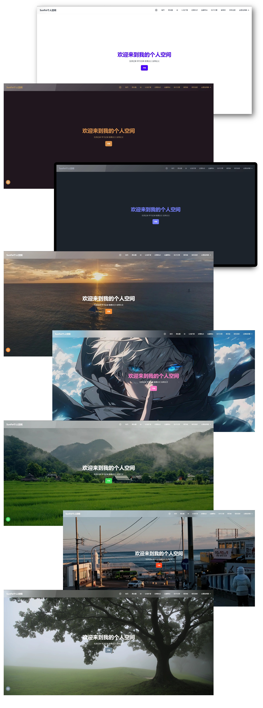
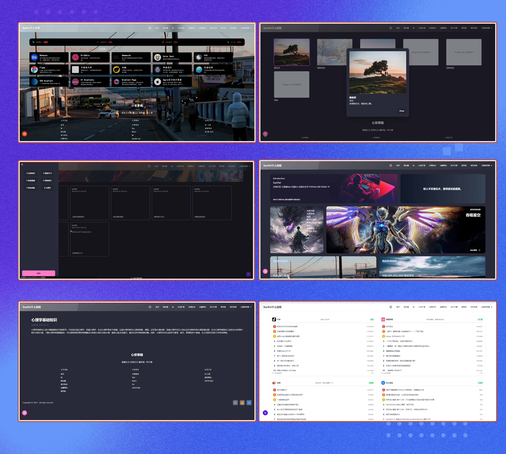

## 介绍
2024年新版的个人博客,采用react + ts + tailwindcss + daisyui + axios 等技术栈开发.  该项目通过前端的最新技术栈,开发一款多模块集成,高度个性化且实用和简洁的个人博客.

**模块介绍**

- 各大社区媒体短视频的热点新闻速览
- 个人常用的设计UX/UI网站,AI网站,编程网站进行一个聚合
- 个人日记随笔记录
- 个人的技术文章分类归档
- 留言板功能,获取游客的建议or想法
- 包括不限于学习的其他方向的知识的文章的归总等等

**功能介绍**

1. 32套色彩主题 + 4款预设图片背景主题 + 自定义图片背景主题
2. 4款预设字体 随心换
3. 抖音当日热点前50定时推送(corn+webSocket)
4. 暗黑亮白主题一键切换
5. 色彩主题模式 + 图片背景模式 一键切换
6. 页面之间导航动画化,更加丝滑(react-framer-motion)
7. 工具聚合网站标签化查找
8. 请求loading动画优化,文章详情页loading动画优化,各个页面loading动画优化等等
9. 留言板随机bing壁纸
10. 留言板块采取游客模式
11. 评论展示用户的地理位置,设备信息等等.
12. 聚合各大短视频or社区平台的热点新闻进行展示.
13. 用户头像上传服务器前进行压缩处理,减少服务器的压力
14. 采用tailwindcss的响应式完美兼容了移动端展示.
15. ...

## 项目展示

### 主题展示

> 还有更多色彩主题,这里不再一一展示,更多欢迎大家访问https://sunfei.site/#/ 进行体验

### 各个页面展示

## 项目的进度历史

9/24  
**bug修复 + 体验优化**
1. 图片回显采用前端来做, 之前的做法是上传之后后端返回响应url,渲染, 这样大大增加了服务器的请求次数,而且前端渲染起来也不友好
2. 使用Compressor库在图片上传至服务器前, 进行一次图片的压缩操作, 降低了服务器的压力
3. 个人文章模块的头像替换为个人的, 放在前端上面,默认的
4. 留言板模块输入的表情可以正常显示了,前面出问题是后端设置的DSN连接后面加上了字符集UTF8,而线上数据库因为mysql版本较低设置了utf8mb4字符集. 所以不一致导致了表情无法正常显示.

9/26
**修复 + UI优化**
1. 调整了进度记录的UI展示效果
2. 修复了website_module下的不同主题下文本色彩不匹配的问题

**功能添加**
1. 自定义了三个预设背景图片 + 三套适配该图片的主题色, 分别为自然风景,碧海蓝天,城市行人三套主题.
2. 配置面板允许用户在 默认主题色彩模式 和 背景图片主题模式 进行切换.

> 是否需要存储在数据库, 我想是没有必要在目前的设计下, 因为该site是完全公开的,不需要登录注册.
> 对于每个用户,他们修改了之后主题配置之后,这些信息将会存储在浏览器的本地localStorage中.如果用户不清楚该站点的本地存储信息的话, 那么下次登录依旧使用上吃配置的site config.

9/27
**修复 + UI优化**
1. 昨天部署之后,由于在本地存储的时候使用的是相对路径,而线上图片资源被打包后的命名发送了改变,所以切换时候找不到图片资源. 于是使用import方法导入图片资源,在本地存储的时候使用import 导入的图片变量这样可以避免.

**功能添加**
1. 个性化模块引入 三套预设字体. 允许用户自由选择站点内字体.

9/28
**修复 + UI优化**
1. 修复文章评论模块的背景颜色在图片背景模式下的不匹配
2. 修复了个性化配置的图片主题下的文字(主题名称)的颜色显示不确定的问题.

**功能添加**
1. 订阅频道,消息推送功能.

> 用户可以在设置里面订阅两个频道,(多选). 分别为 `每日热点新闻` + `每日天气情况 `

用户a,进入网站,打开设置, 开启抖音推送,---> 开启定时任务, 设置推送间隔 --> 刷新定时任务

用户a,再次进入网站,读取本地的推送设置,订阅频道,推送间隔 --> 请求接口 --> 开启定时任务. 没有则不开启定时任务.

> 推送间隔暂时放弃, 因为本网站是公开的， 无需登录注册. 所以无法记录每个用户的setting设置. 后端那边也无法记录> 用户设置的间隔时间. 所以暂时不做推送功能.
> 只设置开启推送的开关, 不设置推送间隔时间.

9/29
**修复 + UI优化**
1. 修复了文章评论输入框在pc端的height 数值不准确. 

**功能添加**
1. 订阅定时推送

10/2

**修复 + UI优化**
图片背景模式
1. 站点配置的close按钮 取消掉 换成右上角的X icon 图标 ✅
2. 文章模块下的二级页面 即文章列表下的文字颜色不明显 应该换成浅白色 ✅
3. 文章详情页面，代码块的背景色也变透明了，应该和色彩模式下保持一致的
4. 城市行人主题下的我的诗模块 打卡之后弹出的dialog 的文字和背景是一个字，修复应该背景白色，文字黑色。✅
5. 图片模式下我的诗的drawer 文字颜色和背景颜色一致 修复。✅
6. 图片模式下我的诗modal打开后按钮看不出来的问题
7. 图片模式下 setting的抖音订阅的switch 切换按钮看不出来
8. 用户信息填写的文字和背景颜色一致, 修复为白色背景 黑色文本✅

其他修复
1. 在移动端的时候 把setting icon 移到导航栏上, 只需要使用icon即可，简约 ，用户也可以看明白的 ✅
3. 🌇海峡主题的主色调换成橙色比较好些 ✅
4. 文章列表下的每篇文章的describtion 限制为3行。 排版保持一致 ✅

**功能添加**
1. 我的诗模块中抽屉drawer里面内容填写成我的话。 ✅ 
2. 新增了一个马赛克风格的字体 ✅
3. 将黑暗 dart 和 亮白 light 主题 单独做成icon切换 放在navbar ✅ 

10/6

**其他事项**
1. 将网站进行了域名注册, 配置了ssl证书✅
2. 修复ws --> wss 协议✅
3. 配置了反向代理✅
4. 后端头像返回的url 设置为代理的target_url✅
5. 不断调整在图片模式的各个细节地方的适配效果✅
6. 对于设置面板添加了随机pc,mobile 端的在线链接,扩展性更好✅